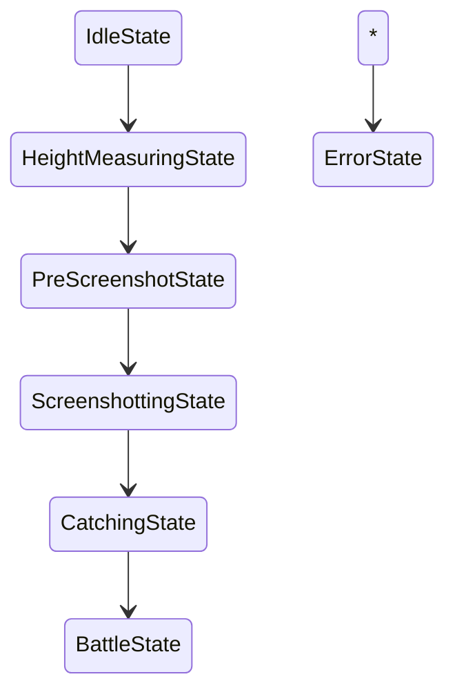

# PetHunter 架构设计（分层 + 状态机）

## 目标

把面向未来的“抓宠/截图/高度维持/对战异色判断”的自动化能力，拆成清晰的模块与接口，避免把业务逻辑写死在 UI 代码里，从而便于持续迭代扩展。

## 分层（推荐）

1. `ui/`
   - Qt 视图层：负责接收用户输入、显示状态/高度/结果，并把用户操作转成事件。
2. `app/`
   - 应用层：显式状态机（State Machine）与事件分发，决定当前应该执行哪一类流程。
3. `features/`
   - 领域/业务特性层：测量、高度控制、截图调度、YOLO 识别、抓宠、对战等“可替换的能力”。
4. `infrastructure/`
   - 平台能力层：Windows 窗口查找与前置、鼠标/键盘模拟、透明叠加层渲染等。
5. `config/`
   - 统一配置与路径：集中管理 `runs/` 下的配置文件、CSV、截图输出等路径。

## 状态机（State Machine）

采用显式状态机来管理自动化流程。未来状态（当前已有骨架）：

- `Idle`：等待绑定窗口/确认参数
- `HeightMeasuring`：测量飞行高度与落地指标（当前测量台核心逻辑）
- `PreScreenshot`：拉取俯视角、飞到目标高度
- `Screenshotting`：按最小截图间隔与高度条件截图，并交给检测器
- `Catching`：刷污染宠物流程（对准 -> 投球）
- `Battle`：对战流程（红血 -> 异色判断 -> 提示并停止/继续捕捉）
- `Error`：错误恢复入口

概念流程（骨架）：

## 当前落地情况（已实现骨架）

- 新增根目录分层模块与配置/路径模块：
  - `config/paths.py`
  - `config/flight_config.py`
- 测量模块已迁移为领域服务接口（并保留旧导入路径兼容）：
  - `features/measurement/flight_measure_service.py`
  - `features/measurement/height_telemetry.py`
- 显式状态机骨架（事件 + 状态类）已创建：
  - `app/state_machine.py`
  - `app/events.py`
- 未来功能接口（截图调度/识别/抓宠/对战）已创建 stub 文件：
  - `features/screenshot/`
  - `features/detection/`
  - `features/catching/`
  - `features/battle/`
- UI 控件命名与显示文案已做语义化优化（测量台阶段）。

## 下一步建议

1. 把 UI 与 `PetHunterStateMachine` 真正联动（把当前按钮逻辑迁移到 controller）。
2. 把截图/检测/抓宠/对战的 stub 接口逐个接入 state machine。
3. 最终形成“刷污染 -> 对战异色判断 -> 提示停止”的完整流程链路。

